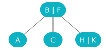
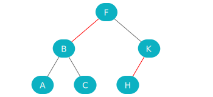

# Tree Visualizer

This is a Next.js application built to create visualizations for 2-3 trees and left-leaning red-black trees. It uses React to create an SVG of the tree using a custom (manual) layout algorithm.

# Live Demo

Check out a live demo [here](https://matthewjselby.github.io/tree-viz/)